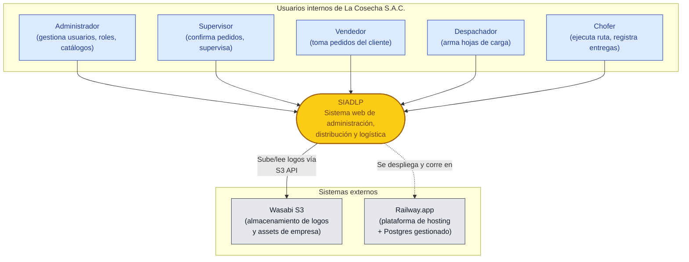
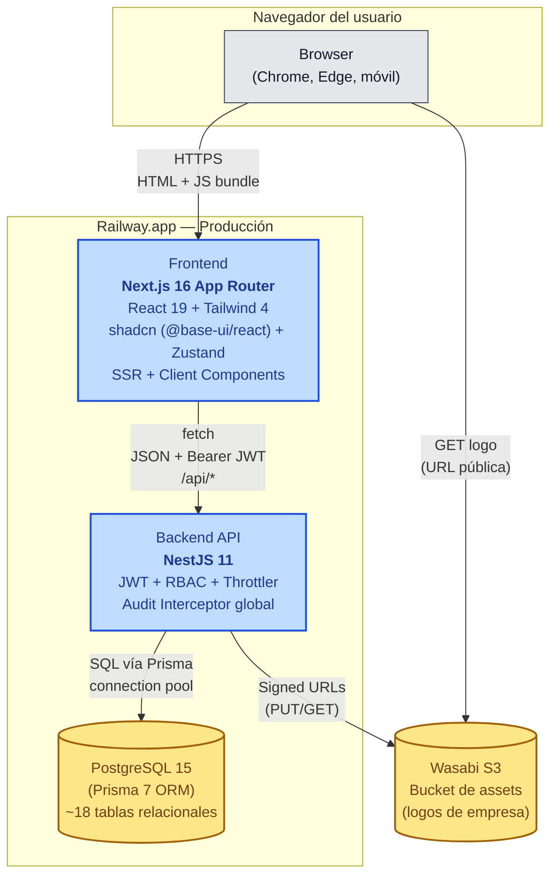
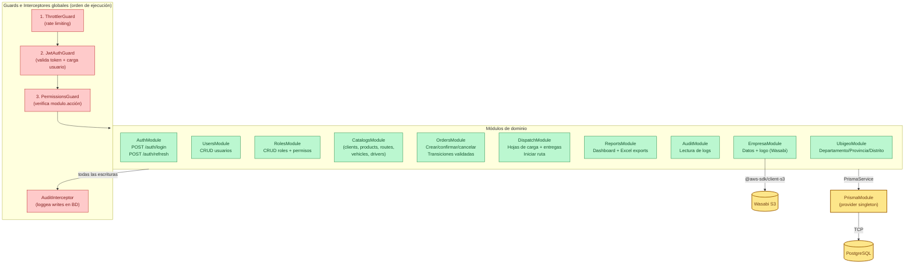
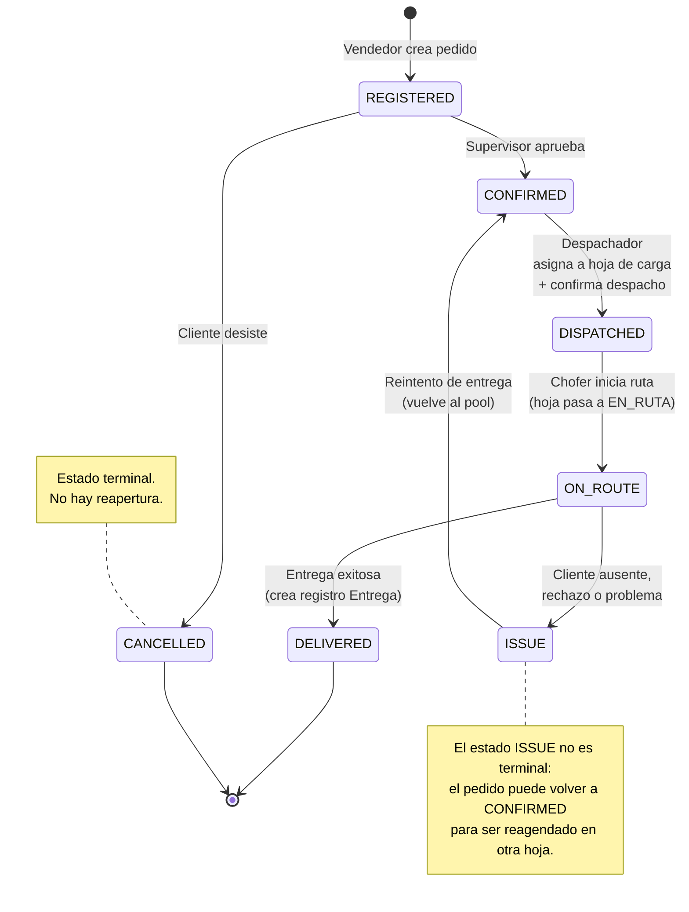
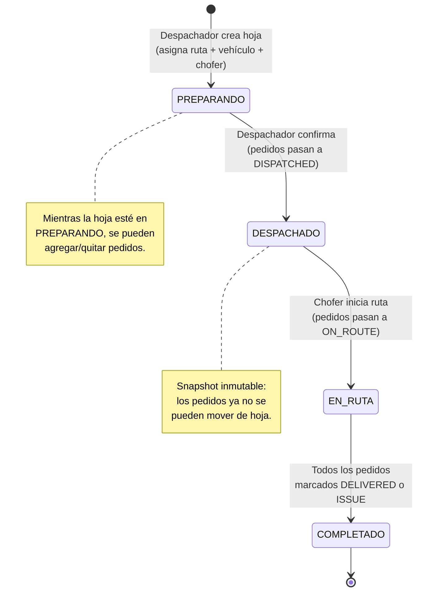

# Arquitectura — SIADLP

> Sistema Integral de Administración, Distribución y Logística de Papa
> Cliente: **La Cosecha S.A.C.** — Distribuidora de papa a pollerías en Lima, Perú
> Documento técnico para sustentación TAP — IDAT

---

## 1. Visión general

SIADLP es una aplicación web tipo **SaaS interno mono-tenant** que digitaliza el ciclo comercial y logístico de una distribuidora de papa: toma de pedidos, confirmación, agrupación por ruta en hojas de carga, despacho, ejecución del recorrido y registro de entregas. Reemplaza un proceso manual basado en cuadernos y planillas Excel por un sistema con trazabilidad de estados, auditoría de operaciones y reportes consolidados.

La solución está construida como un **monorepo pnpm** con dos aplicaciones (frontend Next.js + backend NestJS) y un paquete compartido de tipos y constantes. La autenticación es **JWT stateless con RBAC granular** (matriz `modulo.acción`), lo que permite definir roles (admin, supervisor, despachador, vendedor, chofer) sin tocar código. La capa de datos es PostgreSQL gestionada por Prisma, los archivos estáticos de empresa (logos) viven en Wasabi S3-compatible, y todo se despliega en Railway.

---

## 2. Modelo C4 — Nivel 1: Sistema en su contexto

Muestra los actores humanos y los sistemas externos que interactúan con SIADLP. El alcance del sistema es deliberadamente acotado: una sola empresa distribuidora, sin integración con SUNAT ni pasarelas de pago en la versión actual.



**Decisiones de alcance:**
- No hay integración con facturación electrónica (SUNAT) — fuera de alcance del TAP.
- No hay app móvil nativa para choferes; la web es responsive y se usa desde el navegador del celular.
- No hay multi-tenancy; cada despliegue sirve a una sola empresa.

---

## 3. Modelo C4 — Nivel 2: Containers

Cada container es un proceso independiente, desplegable por separado. La comunicación entre frontend y backend es **HTTP/REST con JSON**; el backend habla con la base de datos vía **TCP/Postgres wire protocol** a través de Prisma.



**Detalles operativos:**
- El frontend corre en `:3020` y el backend en `:4020/api` (configuración local). En Railway, ambos son servicios separados con dominios distintos.
- El JWT se almacena en el cliente (Zustand persistido) y se envía como `Authorization: Bearer <token>` en cada request.
- Throttling global: 20 req/min en endpoints sensibles (login), 300 req/min en general (`@nestjs/throttler`).

---

## 4. Modelo C4 — Nivel 3: Components (Backend)

Cada módulo NestJS encapsula un **dominio del negocio** y expone un controlador REST. Hay tres guards globales (`Throttler`, `JwtAuth`, `Permissions`) y un interceptor (`Audit`) que se aplican a TODA la API, salvo decoradores `@Public()`.



**Convenciones de los módulos:**
- Cada módulo tiene `*.module.ts`, `*.controller.ts`, `*.service.ts`, `dto/*.dto.ts`.
- DTOs validados con `class-validator` (decoradores `@IsString`, `@IsInt`, `@IsEnum`, etc.).
- Servicios reciben `PrismaService` por DI; nunca instancian Prisma directamente.
- El controlador usa decoradores `@RequirePermissions('modulo.acción')` para autorizar.

---

## 5. Flujo de un request típico

Caso: un **vendedor crea un pedido**. Muestra cómo cada capa contribuye y dónde se aplican validaciones, autorización y auditoría.

```mermaid
sequenceDiagram
  autonumber
  participant U as Vendedor
  participant FE as Frontend<br/>(Next.js)
  participant TG as ThrottlerGuard
  participant JG as JwtAuthGuard
  participant PG as PermissionsGuard
  participant C as OrdersController
  participant S as OrdersService
  participant V as Validador<br/>(class-validator)
  participant P as PrismaService
  participant DB as PostgreSQL
  participant AI as AuditInterceptor

  U->>FE: Llena formulario "Nuevo pedido"
  FE->>FE: Valida HTML5 + cliente
  FE->>TG: POST /api/orders<br/>Bearer <JWT> + body JSON
  TG->>TG: ¿Bajo el límite?<br/>(20-300 req/min)
  TG->>JG: ok
  JG->>JG: Verifica firma JWT,<br/>extrae userId, rolId
  JG->>PG: req.user poblado
  PG->>PG: ¿usuario tiene<br/>permiso "orders.create"?
  PG->>C: ok
  C->>V: Valida CreateOrderDto
  V-->>C: 400 si inválido
  C->>S: createOrder(dto, userId)
  S->>P: prisma.$transaction([<br/> pedido.create,<br/> detallePedido.createMany,<br/> estadoPedidoLog.create<br/>])
  P->>DB: BEGIN; INSERTs; COMMIT
  DB-->>P: rows
  P-->>S: Pedido completo
  S-->>C: PedidoDto
  C-->>AI: response
  AI->>P: prisma.registroAuditoria.create<br/>(modulo, accion, usuarioId, ip)
  AI-->>FE: 201 Created + JSON
  FE->>FE: Actualiza estado UI,<br/>muestra toast "Pedido REGISTERED"
  FE-->>U: Vista de detalle
```

**Puntos clave:**
- La autorización ocurre **antes** del controlador — un usuario sin permiso nunca ejecuta la lógica de negocio.
- Las operaciones que tocan múltiples tablas (Pedido + DetallePedido + Log) van en una **transacción Prisma** atómica.
- La auditoría se registra **después** de que la respuesta es exitosa, fuera del path crítico de la transacción de negocio.

---

## 6. Modelo de datos

Diagrama ER simplificado con las entidades centrales. Los nombres siguen el schema real (Prisma usa camelCase en TS y mapea a `snake_case` en la BD vía `@map`).

```mermaid
erDiagram
  USUARIO ||--o{ PEDIDO : "crea"
  USUARIO }o--|| ROL : "pertenece a"
  ROL ||--o{ ROL_PERMISO : "tiene"
  PERMISO ||--o{ ROL_PERMISO : "asignado a"

  CLIENTE ||--o{ PEDIDO : "realiza"
  CLIENTE }o--|| RUTA : "asignado a"
  CLIENTE }o--o| DEPARTAMENTO : "ubicado en"
  CLIENTE }o--o| PROVINCIA : "ubicado en"
  CLIENTE }o--o| DISTRITO : "ubicado en"

  PEDIDO ||--|{ DETALLE_PEDIDO : "contiene"
  PEDIDO ||--o{ ESTADO_PEDIDO_LOG : "registra cambios"
  PEDIDO }o--o| HOJA_CARGA : "agrupado en"
  PEDIDO ||--o| ENTREGA : "genera"
  PRODUCTO ||--o{ DETALLE_PEDIDO : "aparece en"

  HOJA_CARGA }o--|| RUTA : "cubre"
  HOJA_CARGA }o--|| VEHICULO : "asignada a"
  HOJA_CARGA }o--|| CHOFER : "conducida por"
  HOJA_CARGA }o--|| USUARIO : "creada por"

  ENTREGA }o--|| USUARIO : "registrada por"
  USUARIO ||--o{ REGISTRO_AUDITORIA : "produce"

  USUARIO {
    int id PK
    string correo UK
    string contrasena
    string nombre
    int rolId FK
    bool activo
  }
  ROL {
    int id PK
    string nombre UK
  }
  PERMISO {
    int id PK
    string modulo
    string accion
  }
  CLIENTE {
    int id PK
    string razonSocial
    string ruc UK
    int rutaId FK
    string distritoId FK
  }
  PEDIDO {
    int id PK
    int clienteId FK
    date fechaEntrega
    string estado
    int hojaCargaId FK
    int creadoPorId FK
  }
  DETALLE_PEDIDO {
    int id PK
    int pedidoId FK
    int productoId FK
    decimal cantidad
  }
  HOJA_CARGA {
    int id PK
    date fecha
    int rutaId FK
    int vehiculoId FK
    int choferId FK
    string estado
    decimal totalKg
  }
  ENTREGA {
    int id PK
    int pedidoId FK_UK
    string estado
    datetime fechaEntrega
  }
```

**Notas del modelo:**
- `Pedido.hojaCargaId` es **opcional** — un pedido recién registrado o cancelado no tiene hoja.
- `Entrega.pedidoId` es **único** (1:1) — un pedido tiene como máximo una entrega registrada.
- `EstadoPedidoLog` da trazabilidad histórica de cada transición (quién, cuándo, motivo).
- `RegistroAuditoria` cubre todas las operaciones de escritura, no solo las de pedido.
- Tablas omitidas del diagrama por simplicidad: `Empresa` (singleton id=1), `Departamento`/`Provincia`/`Distrito` (catálogo INEI de ubigeo).

---

## 7. Máquina de estados de Pedido

Las transiciones se definen en `packages/shared/src/constants/order-transitions.ts` y se validan en cada cambio de estado tanto en frontend (deshabilitar botones) como en backend (rechazar requests inválidos).



**Reglas duras (del código):**
- Desde `DELIVERED` y `CANCELLED` **no hay transiciones** — son estados absorbentes.
- Desde `CONFIRMED` solo se puede ir a `DISPATCHED` — no se puede cancelar un pedido ya confirmado (decisión de negocio: hay que crear un caso ISSUE).
- La transición `ISSUE → CONFIRMED` es la única "hacia atrás" del flujo y permite reagendar.

---

## 8. Máquina de estados de HojaCarga

La hoja de carga es el agregado logístico que agrupa varios pedidos confirmados de la misma ruta y los asigna a un vehículo y chofer.



**Acoplamiento de máquinas:**
- Confirmar despacho de la hoja (`PREPARANDO → DESPACHADO`) ejecuta en transacción la transición `CONFIRMED → DISPATCHED` para todos sus pedidos.
- Iniciar ruta (`DESPACHADO → EN_RUTA`) propaga `DISPATCHED → ON_ROUTE` a los pedidos.
- La hoja llega a `COMPLETADO` cuando ningún pedido suyo queda en `ON_ROUTE`.

---

## 9. Decisiones arquitectónicas clave

Los ADR (Architecture Decision Records) viven en `docs/adr/`. Son documentos cortos que registran **el contexto, la decisión y las consecuencias** de cada elección arquitectónica relevante.

| # | Decisión | Resumen |
|---|----------|---------|
| ADR-001 | Stack NestJS + Next.js | Backend NestJS por su modularidad, DI y guards declarativos; frontend Next.js App Router por SSR + RSC + ecosistema React. Ver [`docs/adr/ADR-001-stack-nestjs-nextjs.md`](adr/ADR-001-stack-nestjs-nextjs.md). |
| ADR-002 | RBAC con matriz de permisos | En lugar de roles hardcodeados, los permisos se modelan como `(modulo, acción)` y se asignan a roles vía tabla `RolPermiso`. Permite crear roles nuevos sin redeploy. |
| ADR-003 | Estados como string + tabla de transiciones | Los estados de Pedido son `string` en BD (no `enum` Postgres) para evitar migraciones al evolucionar el flujo. La validez se define en `packages/shared`. |
| ADR-004 | JWT stateless sin Redis | Para el alcance del TAP, JWT firmado es suficiente. No se implementa blacklist; un cambio de contraseña no invalida tokens existentes hasta su expiración. Trade-off documentado. |
| ADR-005 | Auditoría como interceptor global | Toda escritura pasa por `AuditInterceptor`. Evita olvidar logs en cada endpoint y centraliza el formato. Costo: ~1 INSERT extra por write. |

> **Nota:** Solo ADR-001 está formalmente documentado en este momento. ADR-002 a ADR-005 son decisiones efectivas presentes en el código y se documentarán en formato MADR antes de la sustentación final.

---

## 10. Trade-offs y limitaciones

Decisiones honestas sobre lo que el sistema **no hace** y por qué.

| Área | Limitación actual | Razón | Mitigación / Plan |
|------|-------------------|-------|-------------------|
| **Tiempo real** | El chofer no ve actualizaciones push del despachador (ni viceversa). Hay que refrescar. | WebSockets agregan complejidad operativa (sticky sessions, reconexión) que excede el alcance del TAP. | Polling cada 30s en vistas críticas. WebSockets / SSE en evolución. |
| **Caché** | Cada request hace ida a BD; no hay Redis ni edge cache. | El volumen actual (1 empresa, ~50-200 pedidos/día) no lo justifica. | Agregar `cache-manager` + Redis cuando p95 > 500ms en endpoints de lectura. |
| **Búsqueda** | La búsqueda de pedidos/clientes usa `LIKE` sobre Postgres con índices B-tree. | Suficiente para los volúmenes actuales. | Migrar a `pg_trgm` o Meilisearch si la BD supera ~100k filas/tabla. |
| **Multi-tenancy** | Una sola empresa por despliegue. Tabla `empresa` con `id=1` fija. | El cliente es una sola distribuidora; multi-tenancy real (row-level security) sería over-engineering. | Si se vende a más empresas, separar por instancia (más simple) o agregar `tenantId` (más complejo). |
| **Observabilidad** | Logs a stdout + auditoría en BD. No hay APM ni tracing distribuido. | Costo de OpenTelemetry / Datadog no se justifica al volumen actual. | Si crece, integrar OpenTelemetry → Grafana Tempo. |
| **Refresh tokens** | El JWT dura X horas; al expirar, el usuario relogea. No hay refresh token. | Simplicidad. Sin Redis no hay forma robusta de revocar refreshes. | Migrar a access + refresh con blacklist en Redis si la UX lo requiere. |
| **Inventario** | El sistema actual modela pedidos pero no descuenta stock automáticamente. | El alcance del MVP del TAP se concentró en distribución, no en producción/inventario. | Diseño previsto pero fuera de la versión sustentada. |
| **Pagos / cobros** | No se registran cobros ni saldos por cliente. | Decisión explícita del cliente (manejan caja aparte). | Posible módulo futuro. |
| **App móvil** | El chofer usa la web responsive desde el celular. | Una app nativa (RN/Flutter) duplicaba el esfuerzo y no agregaba valor inmediato. | PWA con instalación + offline-first es el siguiente paso lógico. |

---

## 11. Plan de evolución

Roadmap técnico ordenado por valor / esfuerzo. No es compromiso de fechas; es la dirección si el sistema entra en producción real.

### Fase 1 — Endurecimiento (post-TAP, 1-2 meses)
1. **Refresh tokens + revocación** vía Redis (`BLACKLIST:<jti>`).
2. **Observabilidad básica:** structured logs JSON + OpenTelemetry → Grafana Cloud (free tier).
3. **Tests E2E ampliados** con Playwright cubriendo los 5 flujos críticos.
4. **Migrations forward-only** con script de rollback documentado.

### Fase 2 — Performance y UX (3-6 meses)
1. **Caché Redis** en endpoints de catálogo (productos, rutas, clientes) — TTL 5 min.
2. **Realtime** vía SSE para vista del despachador (estado de hojas en curso).
3. **PWA + offline-first** para el chofer (cola de entregas pendientes que sincroniza al recuperar red).
4. **Dashboard** con KPIs (pedidos del día, on-time delivery rate, ruta más rentable).

### Fase 3 — Escala (6-12 meses, si aplica)
1. **Multi-tenancy** con `tenantId` + RLS de Postgres.
2. **Búsqueda full-text** (`pg_trgm` o Meilisearch).
3. **Read replicas** de Postgres para reportes pesados.
4. **CDN** para assets de Next.js (Cloudflare delante de Railway).
5. **Integración SUNAT** para emisión de boletas / facturas electrónicas.
6. **API pública** (versionada `/v1/`) con OpenAPI generado por NestJS Swagger.

### Fase 4 — Inteligencia (visión)
1. **Optimización de rutas** con algoritmos VRP (Vehicle Routing Problem).
2. **Forecast de demanda** por cliente/zona con series temporales.
3. **App nativa para chofer** con captura de firma y foto de entrega.

---

## Apéndice A — Convenciones del repositorio

| Aspecto | Convención |
|---------|-----------|
| Package manager | `pnpm` (workspaces) |
| Estructura | Monorepo: `apps/backend`, `apps/frontend`, `packages/shared` |
| Estilo de código | TypeScript strict, ESLint, Prettier |
| Commits | Conventional commits (`feat:`, `fix:`, `refactor:`, `docs:`, `chore:`, `test:`) |
| Ramas | `main` (estable), `feat/*`, `fix/*` |
| CI | GitHub Actions — lint + tests en cada PR |
| Despliegue | Railway.app (auto-deploy de `main`) |
| Naming BD | `snake_case` (vía `@map` de Prisma); modelos TS en `PascalCase` español |

## Apéndice B — Referencias

- Schema Prisma: [`apps/backend/prisma/schema.prisma`](../apps/backend/prisma/schema.prisma)
- Estados de pedido: [`packages/shared/src/enums/order-status.ts`](../packages/shared/src/enums/order-status.ts)
- Estados de hoja: [`packages/shared/src/enums/dispatch-status.ts`](../packages/shared/src/enums/dispatch-status.ts)
- Transiciones permitidas: [`packages/shared/src/constants/order-transitions.ts`](../packages/shared/src/constants/order-transitions.ts)
- Bootstrap del backend: [`apps/backend/src/app.module.ts`](../apps/backend/src/app.module.ts)
- Plan de testing: [`docs/TESTING.md`](TESTING.md)
- Diagramas de flujo de negocio: [`docs/flujos/`](flujos/)
- ADR-001 (stack): [`docs/adr/ADR-001-stack-nestjs-nextjs.md`](adr/ADR-001-stack-nestjs-nextjs.md)
